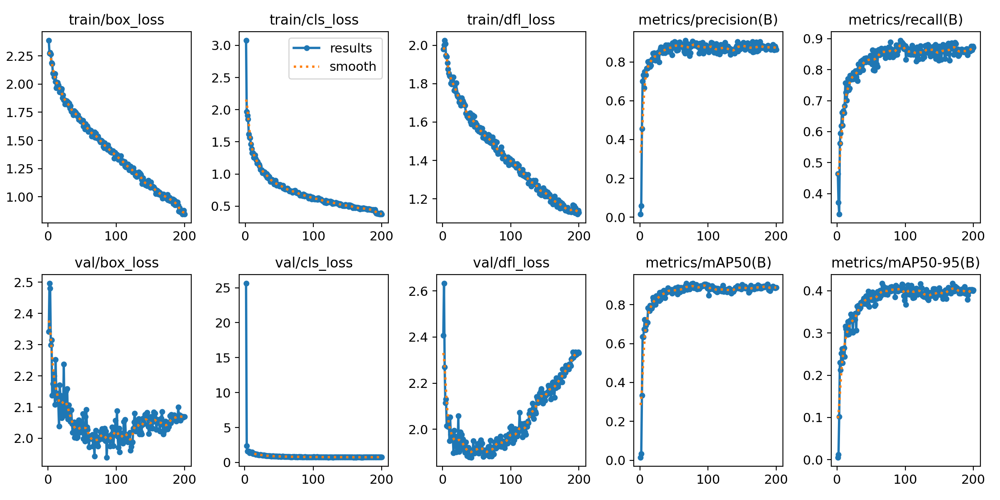
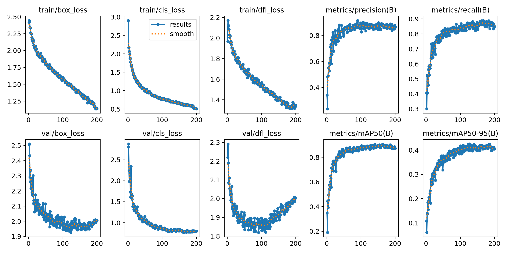
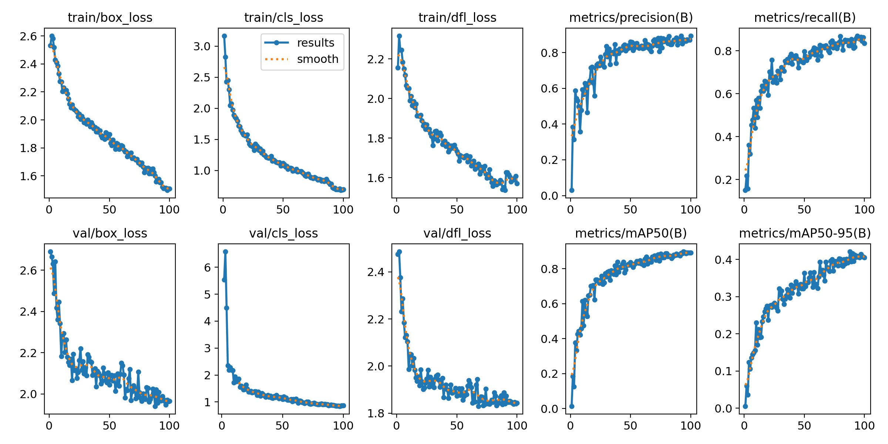
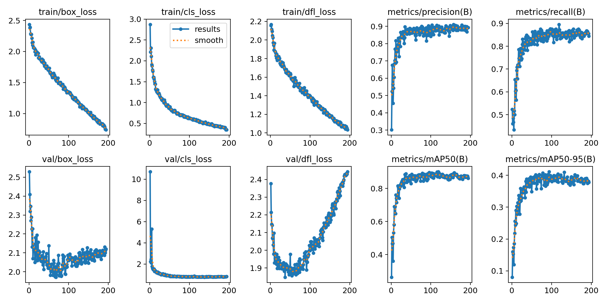
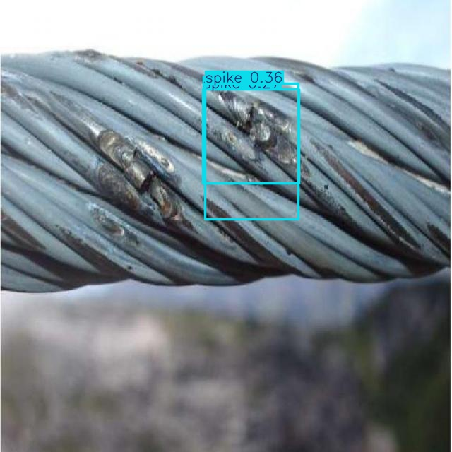
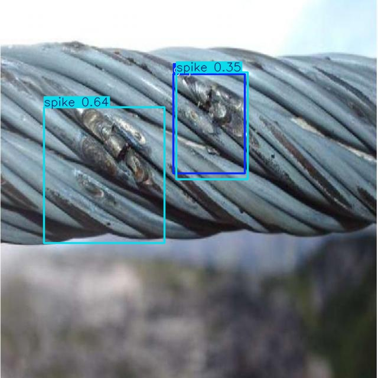
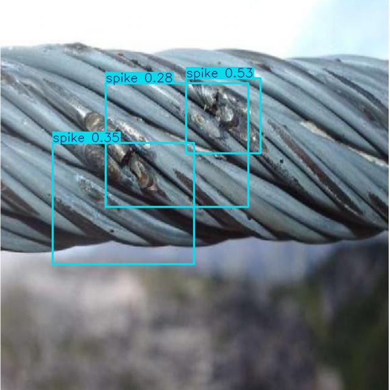
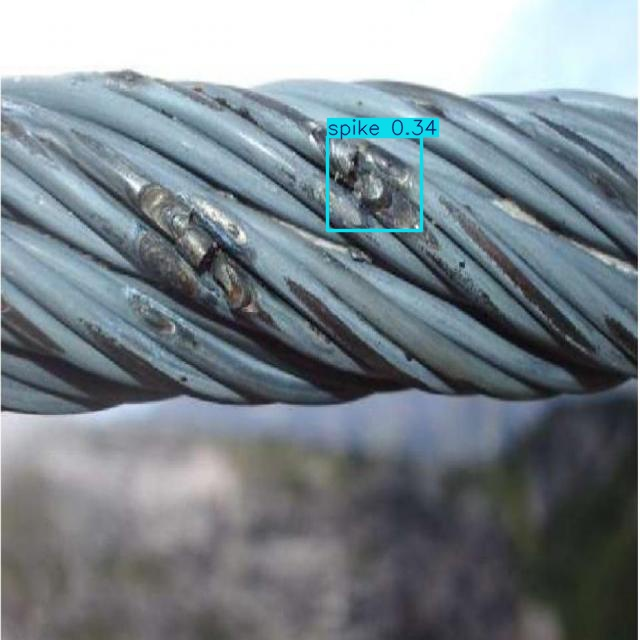

# AlterEgo
AlterEgo это модель обученная с использованием предобученной модели YOLO для распознавания повреждений на тросах.
## AlterEgo: Training
Для тренировки модели необходимо использовать скрипт ```main.py``` из папки ```train```.
Для его использование необходимо следующее:
1. Python 3.8-3.12
2. PyTorch 1.8 и выше
3. NVIDIA CUDA, если используются видеокарта NVIDIA и CUDA ядра
4. Библиотека ultralitics
5. Дата-сет, его можно найти в папке ```train/datasets```
6. Предобученную модель YOLO любой версии, как правило версии 8 и выше показывают лучший результат по время обучения
7. (Прямые руки)
8. Запуск осуществляется с помощью ```python main.py``` или ```python3 main.py```

Проводилось обучение на следующей конфигурации:
1. Процессор Intel Core i5 11400H 2.7GHz
2. Оперативная память: 64 ГБ
3. Видеокарта NVIDIA 3060 RTX 6 ГБ видео памяти

Длительность обучения для разный моделей:
1. YOLOv8 - 1 час 40 минут (200 эпох)
2. YOLOv11 - 1 час 40 минут (200 эпох)
3. YOLOv12 - 1 час 22 минуты (100 эпох). 2.5 часа, если на 200 эпохах
4. YOLOv3u - 14 часов

### Результаты обучения
YOLOv8<br>
<br>
YOLOv11<br>
<br>
YOLOv12<br>
<br>
YOLOv3u<br>
<br>

## AlterEgo: Using
Для тестирование модели необходимо использовать скрипт ```main.py``` из папки ```test```.
Для его использование необходимо следующее:
1. Python 3.8-3.12
2. PyTorch 1.8 и выше
3. NVIDIA CUDA, если используются видеокарта NVIDIA и CUDA ядра
4. Библиотека ultralitics
5. Набор тестовых изображений, его можно найти в папке ```test/testpictures```
6. Обученная модель AlterEgo (в разделе Releases)
7. Запуск осуществляется с помощью ```python main.py``` или ```python3 main.py```

Проводились тесты на следующей конфигурации:
1. Процессор Intel Core i7 7700 2.4GHz
2. Оперативная память: 16 ГБ
3. Видеокарта NVIDIA GTX 1060 6 ГБ видео памяти

### Результаты тестов
YOLOv8<br>
<br>
YOLOv11<br>
<br>
YOLOv12<br>
<br>
YOLOv3u<br>
<br>